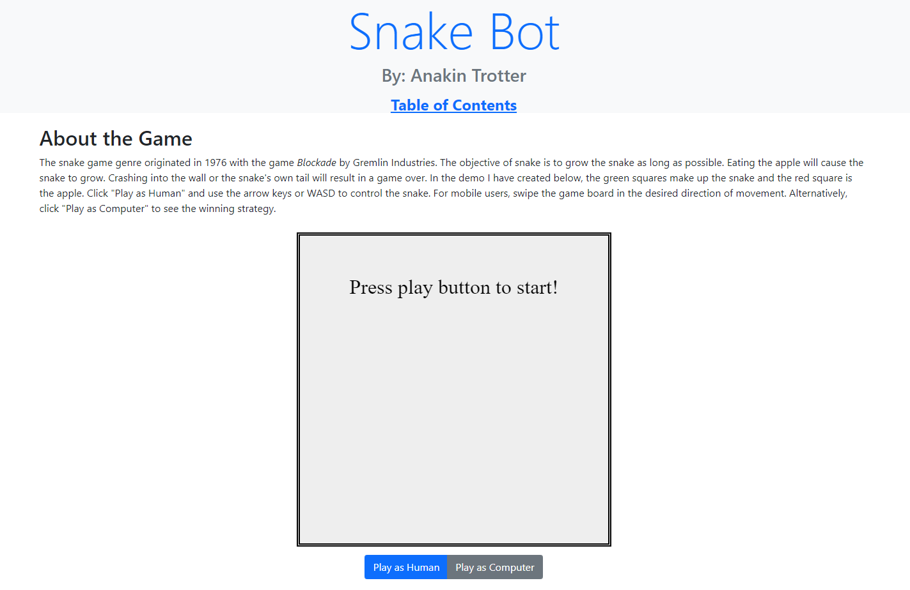

# Snake Bot

---

## Table of Contents

- [snake-bot-site](#snake-bot-site)
  - [Table of Contents](#table-of-contents)
  - [About the Project](#about-the-project)
  - [Prerequisites](#prerequisites)
  - [Built With](#built-with)
  - [Technologies Used](#technologies-used)
  - [Practices Used](#practices-used)
  - [Deployed Link](#deployed-link)
  - [Contributing](#contributing)
  - [License](#license)
  - [Questions](#questions)

## About the Project
 
   

## Prerequisites
A modern internet browser such as Chrome, Firefox, or Safari.

## Built With
* [HTML](https://developer.mozilla.org/en-US/docs/Web/HTML)
* [CSS](https://developer.mozilla.org/en-US/docs/Web/CSS)
* [JavaScript](https://developer.mozilla.org/en-US/docs/Web/JavaScript)
* [Bootstrap](https://getbootstrap.com/)

## Technologies Used

* [Microsoft Visual Studio Code](https://code.visualstudio.com/)
* [GitHub](https://github.com/)
* [Google Chrome Developer Tools](https://developer.chrome.com/docs/devtools/)
  

## Practices Used

* [Web Content Accessibility Guidelines](https://www.w3.org/WAI/standards-guidelines/wcag/)
  
## Deployed Link

* [https://snake-bot-site.herokuapp.com/](https://snake-bot-site.herokuapp.com/) 

## Contributing

Code contributions are welcome! Please create a pull request with your updated code.

## License

This project is covered under the MIT license.

## Questions

Please create an issue should you have any questions or feature suggestions.

Developer's Repositories:  
[Anakin Trotter](https://github.com/AnakinTrotter)
